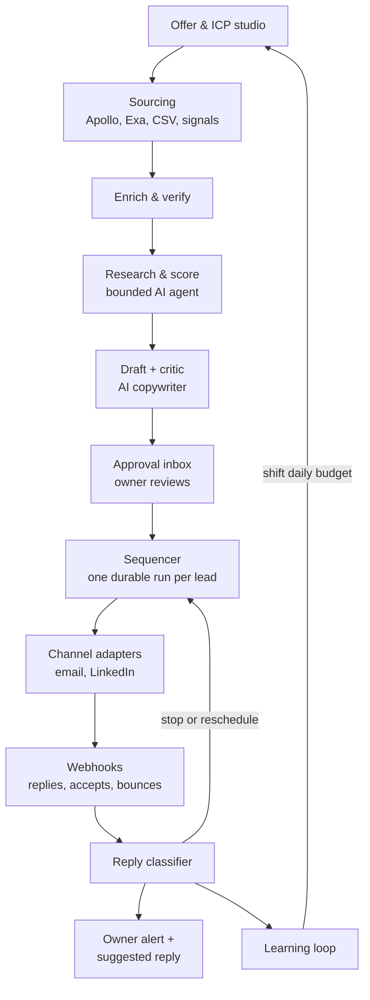
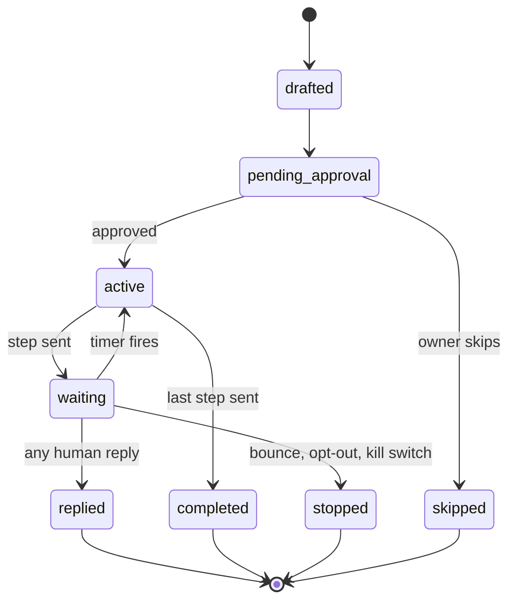
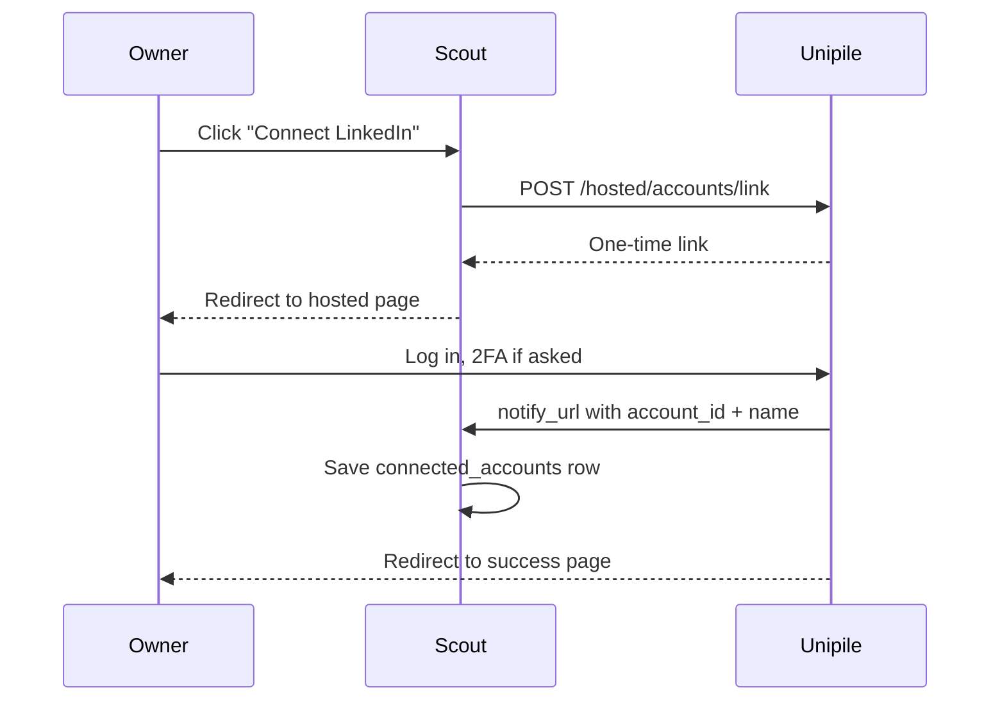

> **This file is the build plan itself (section 10: "Save this plan at the repo root as AGENTS.md").**
> Read DECISIONS.md first: owner answers there extend this plan and override anything below.
> Current build state and what is intentionally not built yet: DECISIONS.md.
# Scout — AI client-finding & outreach engine: build plan

Sep 24, 2026 · @karim

## 0. Locked decisions for v1 (read first)

v1 runs on free tiers everywhere except one mailbox, for about $8–10 a month. This section overrides every other section: where the doc mentions Unipile, Instantly, Apollo API enrichment, Vercel Pro or Claude Sonnet 5, treat it as a future upgrade, not v1.

| Area | Locked v1 choice |
| --- | --- |
| Hosting | Vercel Hobby. One daily cron; Vercel Workflows for all timing. The owner accepts Hobby's non-commercial-use risk |
| Database | Neon free plan (0.5 GB) |
| Email | One Google Workspace mailbox on a secondary domain, sent through the Gmail API with an Internal OAuth app. Replies arrive via Gmail push notifications. No Unipile, no Amazon SES, no transactional senders for outreach |
| LinkedIn | Assisted mode only: Scout creates tasks, the owner clicks send. No LinkedIn automation or unofficial LinkedIn APIs |
| Lead data | Apollo free plan, Exa free credit, CSV import. Emails found by name + domain pattern guesses checked with Reoon and ZeroBounce free credits |
| AI | Vercel AI Gateway free $5 credit every 30 days. Copy on Claude Haiku 4.5. Company research on the Gemini free tier, public company data only, never personal data |
| Alerts | Telegram bot. Amazon SES may send alerts to the owner only |

### Free-tier quotas the code enforces

| Resource | Daily limit | Monthly limit |
| --- | --- | --- |
| New email prospects | 5 (quality mode), never above 12 | \~100 |
| Emails sent incl. follow-ups | 50 after warmup; warmup ramps 5 → 10 → 20 → 30 over 4 weeks | \~1,050 |
| LinkedIn invite tasks | 10 | \~200 |
| Exa searches | 45 | \~1,400 |
| Email verifications | 23 | 700 (Reoon 600 + ZeroBounce 100) |
| AI Gateway spend | — | $5 per 30 days |
| Workflow events | — | 50,000; alert at 80% |
| Database storage | — | 0.5 GB; alert at 80%, prune raw payloads after 30 days |

When a quota runs out, that stage pauses until the quota resets and the owner gets an alert. Scout never buys credits, upgrades a plan, or switches provider on its own.

### Decision rules for the coding agent

1. Build only what this doc describes, in the current phase of section 11.
2. Never change a locked choice above, add a service, add a paid plan, or add a dependency outside section 4 without the owner's written OK.
3. If the doc is silent or unclear on anything the owner would notice (behavior, data, cost, providers, UI flows), stop and ask. Do not guess.
4. If a locked choice fails in practice (for example, a free API key is blocked), stop, report what happened, and propose options. Do not switch on your own.
5. Small internal choices (variable names, helper functions, file placement inside the section 10 layout) are yours to make.
6. Record every question and the owner's answer in `DECISIONS.md` at the repo root. Answers there extend this plan.

## 1. Mission, scope and assumptions

Scout is a private, single-user web app on Vercel that finds the right clients for the owner's AI problem-solving services and runs outreach end to end: decide who to target, find them, research them, write to them, follow up, and learn from replies.

The owner stays in control. Nothing is sent without approval until the owner raises the autonomy level (section 9). Scout is the brain; specialist platforms do the risky plumbing: LinkedIn sessions, mailbox connections and contact data.

### In scope for v1

- **Offer and ICP studio:** turn the owner's ideas into 3–7 ranked ideal-customer profiles (ICPs), each with search filters.
- **Sourcing and enrichment:** find companies and decision-makers, verify emails, dedupe, respect a do-not-contact list.
- **Research, scoring, drafting:** an evidence-backed brief per lead, a fit score, and personalized messages per channel.
- **Approval inbox and sequences:** email + LinkedIn steps, timed follow-ups, stop everything on any reply.
- **Reply handling:** classify replies, alert the owner, suggest a response, book meetings.
- **Learning loop:** shift daily volume toward the ICPs and message angles that earn positive replies.

### Not in v1

- Multiple users, teams or billing. One owner, one login.
- Self-built browser automation for LinkedIn. A provider handles sessions.
- Automated cold outreach on WhatsApp, X, Reddit or website contact forms.
- Auto-replying to interested prospects. The owner answers humans.

### Assumptions (edit if wrong)

- B2B targets. Volume starts at 20–40 new people per day across channels and ramps slowly.
- Modest budget, so open-source libraries and free tiers come first; paid platforms only where they remove real risk.
- The owner connects their own LinkedIn account and 1–3 mailboxes on a secondary sending domain.
- Copy is written in the prospect's language; English by default.

## 2. Key decisions

Build the brain, rent the plumbing. Scout owns targeting, research, writing, sequencing and learning. Rented platforms own account connections, sending infrastructure and contact data, because those are where bans, bounces and legal risk live.

For v1, section 0 wins: Gmail API instead of Unipile, assisted LinkedIn, free data sources, Vercel Hobby. The table below is the upgrade path.

### Platform choices

| Concern | Choice | Why | Fallback |
| --- | --- | --- | --- |
| LinkedIn + mailbox connection, send and receive | [Unipile](https://www.unipile.com/pricing-api/) | Hosted login flow, so Scout never stores passwords. One API for LinkedIn, Gmail, Outlook and IMAP, with webhooks. From €49/month for up to 10 connected accounts. | Gmail API direct for email; assisted-manual mode for LinkedIn |
| LinkedIn mode | Assisted by default; automated behind a feature flag | LinkedIn's User Agreement bans third-party automation, and [2026 reports](https://www.joinvalley.co/blog/linkedin-automation-safety-2026) describe enforcement against automation vendors themselves | Stay assisted; lean on email |
| Email at higher volume (100+/day) | [Instantly](https://instantly.ai/blog/api-webhooks-custom-integrations-for-outreach/) adapter, added later | Warmup, inbox rotation, reply webhooks; API v2 needs the Growth plan or above | Smartlead |
| People and company data | [Apollo API](https://docs.apollo.io/docs/api-pricing) | Structured filters (title, industry, size, geo). Enrich only shortlisted leads: about 1 credit per person for email | CSV import from Sales Navigator or Apollo exports |
| Fuzzy or niche ICPs, web research | [Exa](https://exa.ai/docs/websets/api-guide) search + Websets | Natural-language criteria, each result verified against them; async results with webhooks | Plain web search + scraping |
| Email verification | MillionVerifier or Reoon | Cheap per check; keeps bounces low | ZeroBounce, NeverBounce |
| Timed follow-ups | [Vercel Workflows](https://vercel.com/docs/workflows) on the open-source Workflow SDK | Native to Vercel; sleeps from minutes to months; hooks resume a run when a reply arrives | Inngest |
| Hosting | Vercel Pro | [Hobby is non-commercial only](https://vercel.com/docs/limits/fair-use-guidelines) and allows cron once a day | — |
| LLM | Claude via AI SDK 7 and Vercel AI Gateway | Swap providers by config; spend caps per key | Any AI SDK provider |

Transactional senders (Resend, Postmark, SendGrid) are for opted-in mail. Use them only for alerts to the owner, never for cold outreach.

### Channel verdicts

| Channel | Verdict | How Scout uses it |
| --- | --- | --- |
| Email | Core, automated | Sequences from warmed inboxes on a secondary domain |
| LinkedIn | Core, assisted | Invite without a note, then a message after acceptance; owner clicks send unless the flag is on |
| X (Twitter) | Optional, manual | Engage with a prospect's posts before or after the first email; no automated DMs |
| WhatsApp, Telegram | Warm leads only | Only after a prospect shares a number or asks to move there |
| Reddit, Slack and Discord communities | Signal source | Find people asking for help; answer in public, never cold DM |
| Hacker News "Who is hiring", job boards | Signal source | Companies hiring for manual, repetitive roles are automation candidates |
| Upwork, Malt, Contra | Inbound complement | Keep profiles current; not automated |
| Website contact forms | Skip | Spam-like and low reply quality |

Free LinkedIn accounts get roughly 150 invitations a week without a note and about 5 notes a month, per [Unipile's provider limits](https://developer.unipile.com/docs/provider-limits-and-restrictions). That is why the default LinkedIn step is a blank invite followed by a message.

### Plan B: buy the sending layer

If building sequences feels like too much, lemlist or La Growth Machine already run multichannel sequences. Scout would then push leads with personalized variables to their API and read reply webhooks. Everything upstream of sending stays the same, so this swap is cheap later.

## 3. Architecture overview

Scout is one Next.js app (a modular monolith): a pure domain core, vendor adapters at the edges, and Vercel Workflows moving each lead through a fixed pipeline.



Each lead flows down once. Replies loop back to stop that lead's sequence and to teach the allocator which ICPs and angles work.

### Modules

| Module | Responsibility | Runs as |
| --- | --- | --- |
| ICP studio | Offers in, 3–7 ranked ICPs out, each with provider-specific search filters | Server action + LLM structured output |
| Sourcing | Pull candidates per ICP; dedupe; drop anyone on the suppression list | Workflow (batch) |
| Enrichment | Find and verify email; website to markdown; resolve LinkedIn id | Workflow steps |
| Research and scoring | Evidence brief per lead, rubric score, tier A/B/C or disqualify | Workflow steps (LLM) |
| Copywriting | Channel-specific drafts, critic loop, A/B angle tagging | Workflow steps (LLM) |
| Approval inbox | Review, edit, approve, skip, never-contact | Next.js UI |
| Sequencer | One run per enrollment: sends, sleeps, caps, sending windows, stop-on-reply | Vercel Workflows |
| Channels | Send and receive through ports: Unipile email, Unipile LinkedIn, manual LinkedIn, Instantly later | Adapters |
| Inbound | Verify webhook, store raw event, match to lead, resume or cancel the run | API routes |
| Reply handling | Classify intent, suppress, reschedule out-of-office, alert owner, draft a reply | Workflow |
| Meetings | Cal.com booking link; booking webhook moves the lead to "meeting" | API route |
| Analytics and learning | Metrics per ICP × angle, daily budget allocation, weekly ICP review | Daily cron + workflow |

### Architecture rules

- **Ports and adapters.** Domain code never imports a vendor SDK. Each vendor sits behind a port: `LeadSource`, `Enricher`, `EmailVerifier`, `Channel`, `Notifier`.
- **AI decides content, code decides actions.** The LLM writes briefs, scores, copy and reply labels. Code decides who, when, how many, and whether a send is allowed.
- **Idempotent side effects.** Every send is a workflow step keyed by enrollment, step and channel. Retries never double-send.
- **Append-only event log.** Every state change writes to `activity_events`. Dashboards and the learning loop read from it.
- **One daily heartbeat.** A Vercel cron starts the daily planner workflow: allocate budget, source, research, draft, then send the owner a morning digest.

## 4. Tech stack

Everything Scout runs is open source except the rented platforms in section 2 and the managed hosting. TypeScript end to end, one repo, pnpm.

For v1, copy runs on Claude Haiku 4.5 through the AI Gateway free credit and company research on the Gemini free tier (section 0). Sonnet 5 is an upgrade the owner must approve.

| Layer | Choice | Open source? | Notes |
| --- | --- | --- | --- |
| App framework | Next.js (App Router), TypeScript strict | Yes | Server Actions for UI mutations; Route Handlers for webhooks |
| UI | Tailwind CSS + shadcn/ui + TanStack Table | Yes | Dense tables and keyboard shortcuts for the approval inbox |
| Validation | Zod | Yes | One schema per LLM output, webhook payload and env var set |
| Database | Postgres on Neon (Vercel Marketplace) | Postgres yes; Neon hosted | Supabase works too; pick one and stay |
| ORM and migrations | Drizzle ORM + drizzle-kit | Yes | Typed queries; SQL migrations committed to the repo |
| Durable workflows | [Workflow SDK](https://vercel.com/docs/workflows) (`workflow` package) on Vercel Workflows | SDK yes; runtime hosted | `"use workflow"` / `"use step"`, `sleep()`, hooks |
| AI | AI SDK 7 (`ai`) via Vercel AI Gateway | SDK yes; gateway hosted | Structured outputs with Zod; `ToolLoopAgent`-style bounded agents |
| Models | `MODEL_SMART` = Claude Sonnet 5; `MODEL_FAST` = Claude Haiku 4.5 | No | Smart: ICPs, research synthesis, copy. Fast: extraction, critic, reply labels. IDs live in env, never hard-coded |
| App login | Better Auth, Google sign-in, one allowlisted email | Yes | Every route behind auth except signed webhooks |
| Web page to markdown | Jina Reader API, or Firecrawl | Firecrawl yes | Company sites for research; cache by domain |
| LLM tracing and evals | Langfuse + promptfoo | Yes | Traces, cost per lead, prompt regression tests |
| Owner alerts | Telegram Bot API; daily digest by email | — | Hot reply alerts with deep links |
| Meetings | Cal.com | Yes | Booking link in copy; booking webhook updates the lead |
| Tests | Vitest, Playwright, MSW | Yes | MSW mocks every vendor API in tests |

Model IDs change often. The coding agent reads current IDs from the AI Gateway model list at build time instead of writing them from memory.

## 5. Data model

Sixteen Postgres tables, defined in Drizzle, with uniqueness constraints doing most of the safety work. Sequence templates live in code, not the database, so they are versioned with the app.

| Table | Purpose | Key columns |
| --- | --- | --- |
| `offers` | The owner's services and ideas | title, description, proof (case studies, results), price\_hint, status |
| `icps` | Ideal-customer hypotheses per offer | offer\_id, name, rationale, industries\[\], size\_bands\[\], geos\[\], titles\[\], pains\[\], triggers\[\], disqualifiers\[\], search\_filters (jsonb per provider), angles (jsonb), status, rank |
| `companies` | Organizations | domain (unique), name, linkedin\_url, industry, size\_band, country, source, raw (jsonb), enriched\_at |
| `contacts` | People | company\_id, full\_name, title, email (unique), email\_status, linkedin\_url (unique), linkedin\_provider\_id, timezone, language, source, stage |
| `research_briefs` | Evidence per lead | contact\_id, summary, signals (jsonb: fact + url), hooks, ai\_opportunity, confidence, model, cost\_usd |
| `lead_scores` | Fit per lead per ICP | contact\_id, icp\_id, score (0–100), tier, reasons, disqualified\_reason |
| `enrollments` | One lead in one sequence | contact\_id, icp\_id, sequence\_key, sequence\_version, angle, status, current\_step, workflow\_run\_id, next\_action\_at |
| `messages` | Every draft, sent and received message | enrollment\_id, channel, direction, step, subject, body, status, idempotency\_key (unique), provider\_message\_id, thread\_id, scheduled\_for, sent\_at, intent, intent\_data |
| `connected_accounts` | Sending identities | provider, kind (email or linkedin), external\_account\_id, handle, daily\_cap, warmup\_stage, status |
| `send_counters` | Daily rate limiting | account\_id + date (unique), count |
| `suppressions` | Do-not-contact list | kind (email, domain, linkedin) + value (unique), reason |
| `webhook_events` | Raw inbound events | provider + external\_id (unique), event\_type, payload, processed\_at, error |
| `activity_events` | Append-only audit and analytics log | at, actor (system, owner, ai), entity\_type, entity\_id, type, data |
| `experiment_arms` | Learning loop state | icp\_id, angle, alpha, beta, sends, positives, active |
| `learnings` | Distilled insights fed into prompts | scope (global or icp), text, evidence, active |
| `settings` | Singleton config | timezone, sending windows, caps, autonomy\_level, signature, postal\_address, kill\_switch |

The idempotency key is `enrollmentId:step:channel`. A second insert with the same key fails, which is what makes retried sends safe.

### Enrollment lifecycle



Allowed transitions live in one typed map in `src/domain/enrollment.ts`; any other transition throws. Contact stage moves separately: new, researched, qualified or disqualified, contacted, replied, interested, meeting, won or lost.

## 6. AI components

Seven model calls, each with one job, one Zod output schema and one prompt file. None of them can send anything; they only return data that code validates and acts on.

| Component | Model | Input | Output | Pattern |
| --- | --- | --- | --- | --- |
| ICP generator | Smart | Offer, owner's proof, learnings | 3–7 `Icp` objects | Generate, then critic ranks on 5 criteria |
| Research agent | Smart, fast for extraction | Contact, company, ICP | `ResearchBrief` | Bounded tool loop, max 6 tool calls |
| Scorer | Fast | Brief, ICP rubric | Score 0–100, tier, reasons | LLM rubric; code rules override |
| Copywriter | Smart | Brief, angle, offer, channel, step, thread | `Draft` | Evaluator–optimizer with the critic |
| Critic | Fast | Draft, brief, rules | Pass or violations + fix | Up to 2 revision loops, then owner edits |
| Reply classifier | Fast | Inbound message + thread | `ReplyLabel` | Classify, then code routes |
| Weekly strategist | Smart | Metrics, best and worst replies | ICP and angle proposals | Owner approves every change |

### ICP ranking criteria

The critic scores each ICP from 1 to 5 on pain intensity, ability to pay, reachability (can Apollo or Exa find them with emails), proof fit (does the owner's evidence match) and speed to close. Rank by the sum; ties go to reachability.

### Output schemas (starting point)

```ts
export const Icp = z.object({
  name: z.string(),
  rationale: z.string(),
  pains: z.array(z.string()).min(2),
  triggers: z.array(z.string()), // e.g. "hiring 3+ support agents"
  titles: z.array(z.string()),
  industries: z.array(z.string()),
  sizeBands: z.array(z.enum(["1-10", "11-50", "51-200", "201-1000", "1000+"])),
  geos: z.array(z.string()),
  disqualifiers: z.array(z.string()),
  angles: z.array(z.object({ key: z.string(), hook: z.string() })).min(2).max(3),
  exa: z.object({ query: z.string(), criteria: z.array(z.string()).max(5) }),
  scores: z.object({ pain: z.number(), budget: z.number(), reach: z.number(),
                     proofFit: z.number(), speed: z.number() }), // each 1-5
});

export const ResearchBrief = z.object({
  summary: z.string().max(600),
  signals: z.array(z.object({ fact: z.string(), url: z.string().url(),
                              date: z.string().optional() })).max(8),
  likelyPains: z.array(z.string()).max(3),
  aiOpportunity: z.string(), // one concrete idea tied to an offer
  hooks: z.array(z.object({ text: z.string(), signalIndex: z.number().int() })).max(3),
  confidence: z.enum(["low", "medium", "high"]),
});

export const Draft = z.object({
  subject: z.string().max(60).optional(),
  body: z.string(),
  claims: z.array(z.object({ text: z.string(), signalIndex: z.number().int() })),
  cta: z.string(),
  angle: z.string(),
});

export const ReplyLabel = z.object({
  intent: z.enum(["interested", "meeting_request", "question", "referral",
    "not_now", "not_interested", "unsubscribe", "out_of_office",
    "bounce", "auto_reply", "other"]),
  summary: z.string().max(200),
  returnDate: z.string().optional(),   // out_of_office
  followUpAfter: z.string().optional(), // not_now
  referral: z.object({ name: z.string(), email: z.string().optional(),
                       title: z.string().optional() }).optional(),
});
```

Apollo filters are built by the Apollo adapter from `titles`, `industries`, `sizeBands` and `geos`, not by the model. That keeps vendor field names out of prompts.

### Research agent limits

Tools: `readWebsite(url)`, `webSearch(query)` (Exa), `recentNews(company)` (Exa), and `linkedinProfile(id)` only when LinkedIn automation is on. It stops after 6 tool calls or its token budget, whichever comes first. Website markdown is cached per domain for 30 days.

Cost control is two-pass. Code pre-scores on title, industry and size first. Only passing leads get researched, and only leads scoring 60+ get email enrichment credits.

### Copy rules the critic enforces

- Email 1 is at most 110 words; follow-ups at most 70; LinkedIn messages at most 300 characters.
- One observation tied to a real signal, one concrete idea, one low-friction question as the call to action.
- Every claim in `claims` must point to an existing signal in the brief. Ungrounded personalization fails.
- Plain text. No images, no tracking pixels, no links in email 1 except the signature.
- No flattery, fake familiarity, hype words, or "just following up". Each follow-up adds something new.
- Never invent results, clients or numbers; proof comes only from the offer record.
- Written in the prospect's language, says who the owner is, and ends with an easy opt-out line.

### Prompt hygiene

Prompts are versioned functions in `src/ai/prompts/`. Static context (offer, style rules, learnings) goes first so provider prompt caching applies. Every call logs prompt version, model, tokens and cost to Langfuse and to the row it produced.

## 7. Sequencer and follow-ups

Each enrollment is one durable workflow run that sleeps until its next send slot and wakes early if a lead event arrives. Follow-ups are drafted just in time, so they can reference the thread and fresh signals.

### Default sequence (`email_linkedin_v1`)

| Day | Channel | Action | Skip when |
| --- | --- | --- | --- |
| 0 | Email | Email 1: observation, idea, question | No valid email (use LinkedIn-first variant) |
| 1 | LinkedIn | Invite without a note | No LinkedIn URL |
| On accept + 1 business day | LinkedIn | Short message, different from the emails | Invite not accepted within 14 days |
| 3 | Email | Follow-up in the same thread with one new idea or example | — |
| 7 | Email | Different angle, one question | — |
| 14 | Email | Close the loop politely; offer a useful resource | — |

Any human reply on any channel stops every remaining step. Out-of-office replies reschedule to the return date plus one business day. "Not now" creates a new, approval-gated enrollment on the date the lead gave, or in 90 days.

### Workflow skeleton

```ts
// src/workflows/sequence.ts — shape only; read node_modules/workflow/docs for current APIs
import { sleep, defineHook } from "workflow";

export const leadEvent = defineHook<LeadEvent>(); // reply | accepted | ooo | bounce | optout

export async function sequenceWorkflow(enrollmentId: string) {
  "use workflow";
  const plan = await loadPlan(enrollmentId);                // step
  const events = leadEvent.create({ token: `lead:${enrollmentId}` });
  const it = events[Symbol.asyncIterator]();
  let pending = it.next();

  for (let i = 0; i < plan.steps.length; ) {
    const at = await nextSendSlot(enrollmentId, i);         // step: window, caps, jitter
    const ev = await Promise.race([
      sleep(at).then(() => null),
      pending.then((r) => r.value),
    ]);
    if (ev) {
      pending = it.next();
      const d = await applyEvent(enrollmentId, ev);          // step: stop | reschedule | branch
      if (d.stop) return d;
      continue;                                             // recompute slot for step i
    }
    await prepareMessage(enrollmentId, i);                  // step: draft + critic
    if (plan.steps[i].needsApproval) {
      const ok = await waitForApproval(enrollmentId, i, "3d"); // approval hook vs sleep
      if (!ok) { i++; continue; }                           // expired: skip this step
    }
    await sendMessage(enrollmentId, i);                     // step: guards + idempotent send
    i++;
  }
  return completeEnrollment(enrollmentId);                  // step
}
```

Steps can execute more than once after crashes or retries, so every step with a side effect must be idempotent.

### Send guard

`sendMessage` checks these in order and aborts on the first failure:

1. Kill switch is off.
2. Enrollment status is `active`.
3. Email, domain and LinkedIn URL are not suppressed.
4. No unclassified or human inbound message from this lead since enrollment started.
5. The account's daily cap is not reached (atomic `UPDATE send_counters … WHERE count < cap RETURNING`).
6. Now is inside the recipient's sending window.
7. The message is approved.
8. The idempotency key is unused; mark `sending`, call the provider, store the provider id, mark `sent`.

With `DRY_RUN=true`, every send is rewritten to the owner's test inbox and tagged as a test.

### Pacing defaults (configurable)

| Channel | Daily cap | Ramp-up | Spacing | Window |
| --- | --- | --- | --- | --- |
| Email, per mailbox | 30 new, 50 total | 5 → 10 → 20 → 30 over 4 weeks | 3–9 min random | Mon–Fri 08:30–16:30, recipient's time zone |
| LinkedIn invites (automated mode) | 10, max 80/week | Start at 5 | 1–4 min random | Owner's working hours |
| LinkedIn messages (automated mode) | 25 | Start at 10 | 1–4 min random | Owner's working hours |
| LinkedIn profile lookups | 50 | — | 1–3 min random | Owner's working hours |

In assisted LinkedIn mode, those actions become tasks in the owner's queue: open the profile, copy the message, click done.

### Inbound path

The webhook route verifies the secret, inserts into `webhook_events` (duplicates ignored), and matches the lead by thread, email or LinkedIn id. It stores the inbound message and starts `replyWorkflow`. That workflow classifies the reply, acts on it, and then calls `resumeHook("lead:<enrollmentId>", event)` so the sequence stops or reschedules. Until classification finishes, send-guard rule 4 blocks further sends.

Tests fast-forward time with `@workflow/vitest` (`waitForSleep`, `wakeUp`, `resumeHook`), so a 14-day sequence is tested in seconds.

## 8. Accounts, auth and secrets

Scout never sees a LinkedIn or mailbox password. The owner logs in on Unipile's hosted page, and Scout stores only the account id that comes back.

For v1, the only connected account is one Google Workspace mailbox, linked through Scout's own Internal OAuth app with the Gmail send and read scopes. The Unipile flow below applies only if the owner adds Unipile later.

### Connecting an account



The link request sets `type: "create"`, the providers, a short `expiresOn`, `name` = the owner's id, and `notify_url` + `success_redirect_url` pointing at Scout ([Unipile hosted auth](https://developer.unipile.com/docs/hosted-auth)). Unipile also offers a raw username-and-password endpoint; Scout must not use it.

| Account | How it connects | What Scout stores |
| --- | --- | --- |
| LinkedIn | Unipile hosted auth | Unipile account id, status |
| Google Workspace or Gmail mailbox | Unipile hosted auth (Google OAuth) | Account id, address |
| Outlook or Microsoft 365 mailbox | Unipile hosted auth (Microsoft OAuth) | Account id, address |
| Apollo, Exa, email verifier, AI Gateway, Telegram | API keys in Vercel env vars | Nothing |
| Instantly (later) | Scoped v2 API key in env | Nothing |
| Cal.com | Webhook secret in env | Nothing |

### Account health

Scout registers Unipile webhooks for new messages, new relations (accepted invites), email received and sent, and account status. A status of credentials, error or stopped pauses that account and alerts the owner with a Reconnect button. That button generates a `type: "reconnect"` hosted link.

### App login and webhook security

- Better Auth with Google sign-in. Only `ADMIN_EMAIL` can sign in; everyone else is rejected.
- Middleware protects every route except `/api/webhooks/*` and auth routes. Server Actions re-check the session.
- Each webhook route verifies a shared secret with a constant-time compare, then stores the raw event before doing anything else.
- Preview deployments run with `DRY_RUN=true` and Vercel Deployment Protection.

### Secrets

- All keys live in Vercel env vars, separate for Preview and Production. `.env.example` lists names only.
- Any token that must live in the database is encrypted with AES-256-GCM using `ENCRYPTION_KEY`.
- Logs never contain keys, tokens or full message bodies.

## 9. Guardrails, deliverability and compliance

Safety rules live in code and config, never in prompts, and they are the most heavily tested part of Scout. Thresholds below are starting defaults the owner can change in settings.

### Autonomy levels

| Level | What sends without the owner | When to use |
| --- | --- | --- |
| L0: Draft only | Nothing. Every message waits in the approval inbox | First 2 weeks |
| L1: Approve first touch | Follow-ups that pass the critic; first emails and LinkedIn messages still need approval | After 2 clean weeks |
| L2: Auto-send tier A | Tier A leads with a passing critic, within caps; tier B still needs approval | Only once reply data is healthy |

At every level, replies from humans go to the owner. Scout never auto-replies to a person.

### Circuit breakers

- Mailbox hard-bounce rate above 3% over its last 100 sends: pause that mailbox and alert.
- Google Postmaster Tools spam rate trending above 0.1%: pause all email and alert.
- LinkedIn checkpoint, restriction, or repeated 422/429 errors: pause LinkedIn automation for 7 days.
- An ICP × angle arm with 30%+ negative replies after 30 sends: pause that arm.
- Daily AI spend above `DAILY_AI_BUDGET_USD`: stop research and drafting until tomorrow. AI Gateway key budgets are the backstop.

### Deliverability setup (before the first send)

1. Buy 1–2 secondary domains close to the brand. Never cold-email from the primary domain.
2. Redirect each secondary domain's website to the main site.
3. Set SPF, DKIM and DMARC on every sending domain. Google requires SPF or DKIM for all senders and a spam rate below 0.3% ([summary](https://docs.security.tamu.edu/docs/email-security/FAQ/google-sender-guidelines)).
4. Create 1–3 mailboxes per domain with a real name, photo and signature.
5. Warm each mailbox for 2–3 weeks before any cold send.
6. Verify every address; send only to "valid". Catch-all addresses go LinkedIn-first.
7. Plain text, no tracking pixels, no link shorteners. Measure replies, not opens.

### Compliance built-ins (not legal advice)

Rules depend on where recipients are, so Scout ships switches rather than one policy.

- Every email says who the owner is and offers a working opt-out. Opt-outs go to `suppressions` instantly and permanently.
- The signature carries the owner's postal address, which US CAN-SPAM requires for commercial email.
- Each contact stores its data source and collection date, so Scout can answer "where did you get my details" under EU and UK GDPR.
- Some countries require a form of consent for most cold email, including Germany and Canada. A per-country `requiresConsent` flag excludes those geos from cold email by default.
- Contacts who never replied are deleted after 12 months. The suppression list is kept, hashed.
- Each contact page has Export and Delete buttons for data requests.
- LinkedIn automated mode shows a one-time warning that it breaks LinkedIn's terms and can get the account restricted.

## 10. Repo layout and rules for the coding agent

Save this plan at the repo root as `AGENTS.md` (or `CLAUDE.md` for Claude Code) and build one phase at a time from section 11.

```text
scout/
├─ AGENTS.md                   # this plan
├─ DECISIONS.md                # owner answers to open questions
├─ .env.example                # names only, no values
├─ next.config.ts              # withWorkflow(...)
├─ vercel.json                 # one daily cron -> /api/cron/daily
├─ drizzle.config.ts
├─ app/
│  ├─ (auth)/sign-in/
│  ├─ (app)/dashboard/         # metrics, digest, quota usage
│  ├─ (app)/offers/            # offers + ICP studio
│  ├─ (app)/leads/             # table; detail = brief, score, thread
│  ├─ (app)/inbox/             # approval queue + LinkedIn tasks
│  ├─ (app)/replies/           # classified replies, suggested responses
│  ├─ (app)/settings/          # mailbox, caps, windows, autonomy, suppressions
│  └─ api/
│     ├─ auth/[...all]/
│     ├─ oauth/gmail/           # connect the mailbox (Internal OAuth app)
│     ├─ webhooks/gmail/        # Pub/Sub push for new mail
│     ├─ webhooks/calcom/
│     └─ cron/daily/
├─ src/
│  ├─ domain/     # pure TS: types, state machine, guards, quotas, sequences
│  ├─ ports/      # LeadSource, Enricher, EmailVerifier, Channel, Notifier
│  ├─ adapters/   # sources/ (apollo, exa, csv, hn), enrich/, channels/ (gmail, manual-linkedin), notify/
│  ├─ ai/         # schemas.ts, prompts/, agents/
│  ├─ workflows/  # daily-planner, sourcing, research, sequence, reply
│  ├─ services/   # use cases: enrollLead, approveMessage, suppress, ...
│  ├─ db/         # schema.ts, client.ts, migrations/
│  └─ lib/        # env, crypto, logger, time-windows, rate-limit
├─ evals/        # promptfoo configs + fake golden leads
└─ tests/        # unit, workflow time-travel, e2e
```

### Rules

1. **Read current docs, never memory, for fast-moving libraries.** Use `node_modules/ai/docs` and `node_modules/workflow/docs`, Vercel's agent plugin (`npx plugins add vercel/vercel-plugin`), and the `llms.txt` indexes published by Apollo and Exa.
2. **Spike before building an adapter.** Write a 20-line script that calls the real vendor endpoint once, commit the recorded response as a test fixture, then build the adapter.
3. **Domain stays pure.** `src/domain` imports nothing from `adapters`, `db` or vendor SDKs.
4. **Every port has a fake.** Tests run against in-memory fakes and MSW mocks; no test hits a real vendor.
5. **Parse every LLM output with its Zod schema.** On failure retry once, then mark the item "needs owner".
6. **One send path.** Nothing sends except `sendMessage` and its guard; each guard rule has a test.
7. **Idempotent steps.** Every side-effecting workflow step checks a unique key or status first.
8. **Deterministic workflows.** No I/O, clock reads or randomness inside `"use workflow"` functions; compute jitter and slots in steps.
9. **Safe by default.** Local and preview environments run with `DRY_RUN=true`.
10. **Migrations via drizzle-kit only.** Never edit an applied migration.
11. **Redacted logs.** Log contact ids, not emails or message bodies.
12. **Stay inside the plan.** Follow section 0: anything not written in this plan goes to the owner first and into DECISIONS.md.

## 11. Build phases

Phases 0–5 are the MVP: email outreach with follow-ups, end to end. Each phase ships to Vercel and must meet its "done when" before the next starts.

| Phase | Goal | Builds | Done when |
| --- | --- | --- | --- |
| 0. Foundations | A secure, deployable skeleton | Next.js + TS strict, Tailwind + shadcn/ui, Drizzle + Neon, Better Auth allowlist, env validation, `activity_events`, settings page, `DRY_RUN`, CI (lint, typecheck, tests) | Deploys on Vercel Hobby; only `ADMIN_EMAIL` can sign in; migrations run in CI |
| 1. Offer and ICP studio | Know who to target | Offers CRUD, ICP generator + critic, ICP edit and approve, Langfuse tracing | One offer yields 3–7 ranked ICPs that pass Zod, can be edited and saved; cost is logged |
| 2. Sourcing and enrichment | Find real people | Ports; Apollo, Exa and CSV adapters (after spikes); dedupe; suppressions; verifier; website reader cache; pre-score rules | "Find 25 leads for ICP X" returns deduped contacts with a verified email or LinkedIn URL; a re-run adds no duplicates; suppressed people never appear |
| 3. Research, drafting, approval | Good first messages | Research agent with limits, scorer, copywriter + critic, approval inbox with keyboard shortcuts, promptfoo evals | 25 leads get briefs with at least one cited signal, a tier, and a draft that passes the critic; golden-set evals pass |
| 4. Email sending | Safe first sends | Gmail API with an Internal OAuth app for the one mailbox, connected-accounts page, `sendMessage` + guard, `send_counters`, sending windows | An approved email lands in a test inbox inside the window; a forced retry does not double-send; every guard rule has a passing test |
| 5. Sequences and replies | Follow-ups that stop on reply | Sequence workflow, Gmail push notifications, reply workflow + classifier, out-of-office and not-now handling, Telegram alerts, suggested replies | Time-travel tests prove: no reply sends day 3, 7 and 14 follow-ups; a day-5 reply cancels the rest; out-of-office reschedules; opt-out suppresses forever |
| 6. LinkedIn | Second channel | Assisted-mode tasks only. Not in v1: a Unipile LinkedIn adapter (invite, `new_relation` webhook, message) with caps and breakers | Assisted tasks appear and complete |
| 7. Analytics and learning | Double down on what works | Dashboard per ICP × angle × channel, budget allocator, weekly strategist, `learnings` store | The daily planner splits new-lead volume using the allocator; strategist proposals wait for owner approval |
| 8. Hardening | Run unattended | Circuit breakers, retention job, export and delete, error alerts, a 1,000-fake-lead load test | Each breaker has a test; retention deletes exactly what it should; a one-page runbook exists |

**Allocator (phase 7):** each ICP × angle arm keeps a Beta(1 + positive replies, 1 + other sends) belief. Each morning, Thompson sampling splits the day's new-lead budget across arms, with a 10% floor per active arm until it reaches 30 sends. Positive means interested, meeting request, question or referral.

### Owner tasks in parallel

- [ ] Use Vercel Hobby and add Neon Postgres (free plan) from the Marketplace.
- [ ] Buy 1–2 secondary domains, create mailboxes, set SPF, DKIM and DMARC, start warmup in week 1.
- [ ] Create a Google Cloud project with the Gmail API, an Internal OAuth consent screen, and a Pub/Sub topic for Gmail push.
- [ ] Get free keys: Apollo, Exa, Reoon, ZeroBounce, Gemini (AI Studio), AI Gateway, Telegram bot.
- [ ] Write 1–3 offers with real proof: case studies, demos, numbers.
- [ ] Keep LinkedIn in assisted mode (decided for v1).

## 12. Costs and free tiers

v1 costs about $8–10 a month and reaches \~5 new email prospects plus \~10 LinkedIn invites a day. The upgrade paths further down are future options that only the owner can switch on. All prices are approximate as of this doc's date.

### v1 bill: all-free profile (locked)

| Item | Monthly cost |
| --- | --- |
| Google Workspace mailbox | $8.40 ($7 with a yearly commitment) |
| Sending domain | \~$1 (a .com is about $10–15 a year) |
| Vercel Hobby, Neon, Apollo free, Exa credit, Reoon, ZeroBounce, Gemini free tier, Telegram, Cal.com, Langfuse | $0 |
| AI through Vercel AI Gateway | $0 inside the $5 credit every 30 days |
| **Total** | **\~$8–10** |

### v1 daily outreach

| Channel | Per day | Per month (\~21 working days) |
| --- | --- | --- |
| New email prospects, Haiku 4.5 copy (default) | \~5 | \~100 |
| New email prospects, cheaper copy model (owner must approve the switch) | \~9 | \~190 |
| Emails sent including follow-ups (up to 4 per prospect) | \~20–36 | \~400–760 |
| LinkedIn invite tasks | \~10 | \~200 |

The AI credit is the limit, not the mailbox, which could carry \~12 new prospects a day. Month one is mostly mailbox warmup. At 2026 averages, 100–190 prospects a month bring about 2–6 replies and roughly 1 interested lead.

### Upgrade paths (future, owner decides)

| Setup | What you pay for | Approx. per month | New email prospects per month |
| --- | --- | --- | --- |
| Free-first | Vercel Pro, 1 mailbox, 1 domain; everything else on free tiers | $30 base; \~$38 with extra AI to fill the mailbox | \~100 on the free AI credit, up to \~250 |
| Growth | Adds Apollo Basic for API data, a second mailbox, AI beyond the free credit | $110–150 | \~500 |
| Full automation | Adds Unipile for LinkedIn automation and one inbox API, plus a third mailbox | $190–230 | \~750, plus automated LinkedIn within caps |

Upgrade only when results justify it: Apollo Basic once an ICP earns positive replies, another mailbox when one is full, Unipile when manual LinkedIn takes over 15 minutes a day.

At 2026 averages of about 2–3.4% replies and 0.6% interested ([Apollo roundup](https://www.apollo.io/insights/what-is-a-good-benchmark-for-reply-rates-in-cold-outreach), [Cleverly benchmarks](https://www.cleverly.co/blog/cold-email-benchmarks-by-industry)), 250 prospects bring 5–9 replies and 1–2 interested leads. Small, tightly targeted lists reply at more than double the average rate.

### Free plans, platform by platform

| Platform | Free plan | Paid from | Role in free-first Scout |
| --- | --- | --- | --- |
| [Vercel](https://vercel.com/docs/limits/fair-use-guidelines) | Hobby is free but for non-commercial use only | Pro $20/month | v1 runs on Hobby; the owner accepts the non-commercial-use risk |
| [Vercel Workflows](https://vercel.com/docs/workflows/pricing) | 50,000 events/month on Hobby | $0.02 per 1,000 events | About $0.50/month at 250 leads (rough) |
| [Neon Postgres](https://neon.com/pricing) | 0.5 GB and 100 compute-hours per project | Usage-based, no minimum | Enough for thousands of leads |
| [Vercel AI Gateway](https://vercel.com/docs/ai-gateway/pricing) | $5 credit every 30 days, any model; ends after your first purchase | Provider list price, no markup | Copywriting on Claude Haiku 4.5 |
| [Gemini API](https://openrouter.ai/blog/tutorials/free-llm-apis-compared/) (AI Studio) | Flash models with per-minute and daily caps; Google may use free-tier data | Per token | Company research from public pages only |
| [Groq, Cerebras, OpenRouter](https://openrouter.ai/blog/tutorials/free-llm-apis-compared/) | Open models with daily caps | Per token | Backup for research summaries |
| [Exa](https://fastcrw.com/blog/exa-pricing-explained) | $20 at signup, then about $10 credit every month | $7 per 1,000 searches | \~1,400 searches a month |
| [Apollo](https://www.spendflo.com/vendors/apollo-io) | 10,000 email credits/month on a company-domain login, 100 otherwise; [limited API](https://sendkit.ai/apollo-pricing) | Basic $49/month annual, $59 monthly | Manual lookups; test the free API key in the Phase 2 spike |
| [Reoon, ZeroBounce](https://www.g2.com/products/mailtester-com/pricing) | 600 and 100 verifications a month | ZeroBounce \~$18 per 2,000 | \~700 checks a month |
| [Unipile](https://www.unipile.com/pricing-api/) | 7-day trial only | €49/month for up to 10 accounts | Skipped in free-first |
| [Google Workspace](https://www.cloudwards.net/google-workspace-plans-and-pricing/) | No free business plan | $7 annual or $8.40 monthly per mailbox | One sending mailbox |
| Telegram, Cal.com, Langfuse | Free plans | — | Alerts, booking, tracing |

### What one month on free tiers supports

| Constraint | Free allowance | New prospects per month |
| --- | --- | --- |
| 1 warmed mailbox at 50 emails/day, 4 emails per lead | \~1,050 emails | \~250 |
| Email finding: name + domain guesses, \~3 checks per person | \~700 checks | \~230 |
| AI Gateway credit: research on free Gemini, copy on Haiku 4.5 at \~$0.05 per lead | $5 | \~100 |
| Exa credit at 3 searches per lead | \~1,400 searches | \~450 |
| LinkedIn free account, assisted, \~10 invites a day | \~150 invites a week allowed | \~200 invites |

The AI credit runs out first, then email finding. Each prospect past \~100 costs about $0.05 in AI, or about $0.15 if Claude Sonnet 5 writes the copy.

### Free-first swaps

| Use | Instead of | Trade-off |
| --- | --- | --- |
| Gmail API direct, with the OAuth app set to Internal in the sending Workspace; replies via Gmail push notifications | Unipile for email | More code for threading and reply detection; Outlook would need Microsoft Graph |
| Assisted LinkedIn tasks | Unipile LinkedIn automation | You click send, about 5 minutes a day |
| Name + domain pattern guesses checked with Reoon and ZeroBounce | Apollo API enrichment | Slower; catch-all domains stay unverified |
| Free Gemini Flash for company research, Haiku 4.5 for copy | Claude Sonnet 5 everywhere | Never send personal data to a free tier |

Each swap is reversible. The Gmail and Unipile adapters implement the same `Channel` port, so upgrading means adding one adapter and changing config.

## 13. Env vars and sources

### `.env.example`

```bash
# App
APP_URL=
ADMIN_EMAIL=
BETTER_AUTH_SECRET=
GOOGLE_CLIENT_ID=           # app sign-in
GOOGLE_CLIENT_SECRET=
ENCRYPTION_KEY=             # 32 random bytes, base64
OWNER_TIMEZONE=
DRY_RUN=true
DRY_RUN_REDIRECT_EMAIL=
CRON_SECRET=

# Database
DATABASE_URL=

# Mailbox (Gmail API, Internal OAuth app)
SENDER_EMAIL=
GMAIL_OAUTH_CLIENT_ID=
GMAIL_OAUTH_CLIENT_SECRET=
GMAIL_PUBSUB_TOPIC=
GMAIL_PUSH_SECRET=

# AI
AI_GATEWAY_API_KEY=
MODEL_COPY=                 # Claude Haiku 4.5 id from the gateway model list
GEMINI_API_KEY=             # free tier, company research only
MODEL_RESEARCH=

# Data
APOLLO_API_KEY=
EXA_API_KEY=
REOON_API_KEY=
ZEROBOUNCE_API_KEY=

# Quotas (section 0)
DAILY_NEW_PROSPECTS=5
MAX_DAILY_NEW_PROSPECTS=12
DAILY_EMAIL_CAP=50
DAILY_LINKEDIN_TASKS=10
DAILY_EXA_SEARCHES=45
DAILY_VERIFICATIONS=23
MONTHLY_AI_BUDGET_USD=5
LINKEDIN_MODE=assisted      # locked for v1

# Alerts and meetings
TELEGRAM_BOT_TOKEN=
TELEGRAM_CHAT_ID=
CALCOM_BOOKING_URL=
CALCOM_WEBHOOK_SECRET=

# Observability
LANGFUSE_PUBLIC_KEY=
LANGFUSE_SECRET_KEY=
LANGFUSE_HOST=
```

### Sources

- [Unipile provider limits](https://developer.unipile.com/docs/provider-limits-and-restrictions) and [hosted auth](https://developer.unipile.com/docs/hosted-auth)
- [Apollo API pricing and credits](https://docs.apollo.io/docs/api-pricing)
- [Exa Websets API guide](https://exa.ai/docs/websets/api-guide)
- [Vercel Workflows](https://vercel.com/docs/workflows), [Workflow SDK scheduling patterns](https://useworkflow.dev/cookbook/common-patterns/scheduling), [Workflow SDK testing](https://useworkflow.dev/docs/testing)
- [Vercel cron limits](https://vercel.com/docs/cron-jobs/usage-and-pricing) and [fair use guidelines](https://vercel.com/docs/limits/fair-use-guidelines)
- [AI SDK 7 announcement roundup](https://community.vercel.com/t/vercel-weekly-2026-06-15/43802)
- [Instantly API and webhooks](https://instantly.ai/blog/api-webhooks-custom-integrations-for-outreach/)
- [LinkedIn automation enforcement in 2026](https://www.joinvalley.co/blog/linkedin-automation-safety-2026)
- [Google and Yahoo sender requirements summary](https://docs.security.tamu.edu/docs/email-security/FAQ/google-sender-guidelines)

